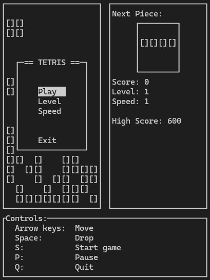

# Sharlabr's Brick Game

<!-- Создано с использованием "Best-README-Template" в качестве шаблона -->
<!-- https://github.com/othneildrew/Best-README-Template -->
<!-- "Best-README-Template" distributed under the MIT License. See https://github.com/othneildrew/Best-README-Template/blob/main/LICENSE.txt for more information. -->

<!-- PROJECT LOGO -->
<div align="center">
    
    <p align="center">Реализация классической игры тетрис для проекта *C7_BrickGame_v1.0*</p>
</div>

<!-- ABOUT THE PROJECT -->
## О проекте

<div align="center">



</div>

Этот проект представляет собой консольную версию классической игры "Тетрис", реализованную на языке C (стандарт C11) в рамках учебного задания. Основная цель проекта — закрепление знаний и навыков программирования путём создания игры с использованием библиотеки ncurses для отрисовки консольного интерфейса.

В дополнение к обязательным и дополнительным условиям сдачи проекта также реализованы:
 - Интерактивное меню для начала игры и паузы.
 - Настройка скорости игры и заполнения линий перед стартом.
 - Запись рекордов (high score) в файл, расположенный в корневой папке пользователя.

Особенностью проекта является отсутствие динамического выделения памяти, за исключением функционала ncurses. Игровой движок оформлен в виде статической библиотеки, что позволяет использовать его в дальнейших проектах.
Проект завершен и сопровождается документацией, сгенерированной с помощью кастомной версии doxygen.
Страницы информации о покрытии генерируются с помощью утилиты gcovr, а не lcov, поэтому она должна быть установлена перед сбором информации о покрытии.

## Инструкции к игре

### Управление

- `Влево`: сдвинуть фигуру влево.
- `Вправо`: сдвинуть фигуру вправо.
- `Вниз`: сбросить фигуру.
- `Пробел`/`Ввод`: повернуть фигуру.
- `S`: начать или продолжить игру.
- `P`: поставить игру на паузу.
- `Q`: закончить игру и выйти в меню.

### Настройки перед игрой

В стартовом меню можно задать следующие параметры:
- **Скорость игры**: по умолчанию установлена на 1.
- **Первичное заполнение поля**: уровень, означающий количество заполняемых снизу линий.

### Завершение игры

Когда игра заканчивается, счёт игрока проверяется. Если он превышает текущий рекорд, то новый рекорд записывается в файл `~/score.bin`.

## Установка и запуск

### Требования

Для сборки и запуска проекта вам понадобятся:
- **GCC** версии 10 или выше.
- **Библиотека ncurses**.
- **Библиотека check.h** для тестирования
- **doxygen** кастомной сборки для генерации документации. Подробнее см. [Генерация документации](#генерация-документации)
- **gcovr** версии 7.0 или выше для генерации отчёта. Подробнее см. [Генерация отчёта о покрытии](#генерация-отчёта-о-покрытии)

### Сборка проекта

Проект можно собрать с использованием Makefile. Основные команды сборки:
- `make build` — собирает только исполняемый файл и помещает его в папку `src`.
- `make install` — собирает исполняемый файл в папку `bin` и документацию проекта.
- `make all` или просто `make` — полная сборка проекта, включает создание исполняемого файла в папке `bin`, документации и выполнение тестов.
- `make dvi` — генерирует документацию проекта.
- `make dist` — собирает проект в архив (тарболл).

### Запуск тестов

Тесты собираются и запускаются с помощью команды:`make test`
Команда запускает тесты напрямую, а также она автоматически вызывается в целях `make gcov_report` и `make all`.

### Генерация документации

> [!NOTE]
> Сгенерированная версия документации может быть открыта по [ссылке](https://sharlabr-projects.su/C7_BrickGame_S21/doc/)

Для генерации документации используется кастомная версия `doxygen`, скомпилированный для Linux и архитектуры AMD64/x86_64 в Ubuntu 24.04 исполняемый файл которого находится по пути src/doxygen/doxygen.
Если с запуском цели `make dvi` возникают проблемы или документация генерируется не в ОС Linux или на устройстве с другой архитектурой процессора, то возможно использовать релизную версию doxygen (1.12.0) c [официального сайта][doxygen-site] или [github][doxygen-releases], или версию из репозиториев, однако результат может отличаться от задуманного.
Для использования иного исполняемого файла `doxygen` следует запустить цель с заданной переменной `$DOXYPATH`, в которой указать путь до исполняемого файла (из переменной `$PATH` или полный путь до исполняемого файла):
```sh
DOXYPATH=doxygen make dvi
```
Или:
```sh
DOXYPATH=\path\to\doxygen\bin make dvi
```

### Генерация отчёта о покрытии

Отчёт генерируется в папку `src/report`, основной файл `coverage.html`
Для генерации отчёта о покрытии требуется утилита [gcovr][gcovr-site] ([github][gcovr-github]) версии 7.0 или выше, генерация отчёта с помощью средств `lcov` не предусмотрена в Makefile.
В репозиториях Ubuntu доступна устаревшая версия (5.0 на момент написания), поэтому рекомендуется установка через pip:
```sh
pip install gcovr
```
Для того чтобы не устанавливать утилиту в пространство пользователя можно перед установкой создать виртуальное окружение Python и установить gcovr в него:
```sh
python -m venv ./venv
source venv/bin/activate
pip install gcovr
```
После окончания работы папку виртуального окружения можно удалить.

## Контакты

- **Школа21**: Sharlabr
- **GitHub**: [FrostmonsterSP](https://github.com/FrostmonsterSP)
- **Telegram**: [frostmonster](https://t.me/frostmonster)

**Сентябрь 2024г.**

<!-- MARKDOWN LINKS & IMAGES -->
<!-- https://www.markdownguide.org/basic-syntax/#reference-style-links -->
[product-screenshot]: doc/image/screenshot.png
[doxygen-releases]: https://github.com/doxygen/doxygen/releases/
[doxygen-site]: www.doxygen.nl
[gcovr-site]: https://gcovr.com/
[gcovr-github]: https://github.com/gcovr/gcovr
